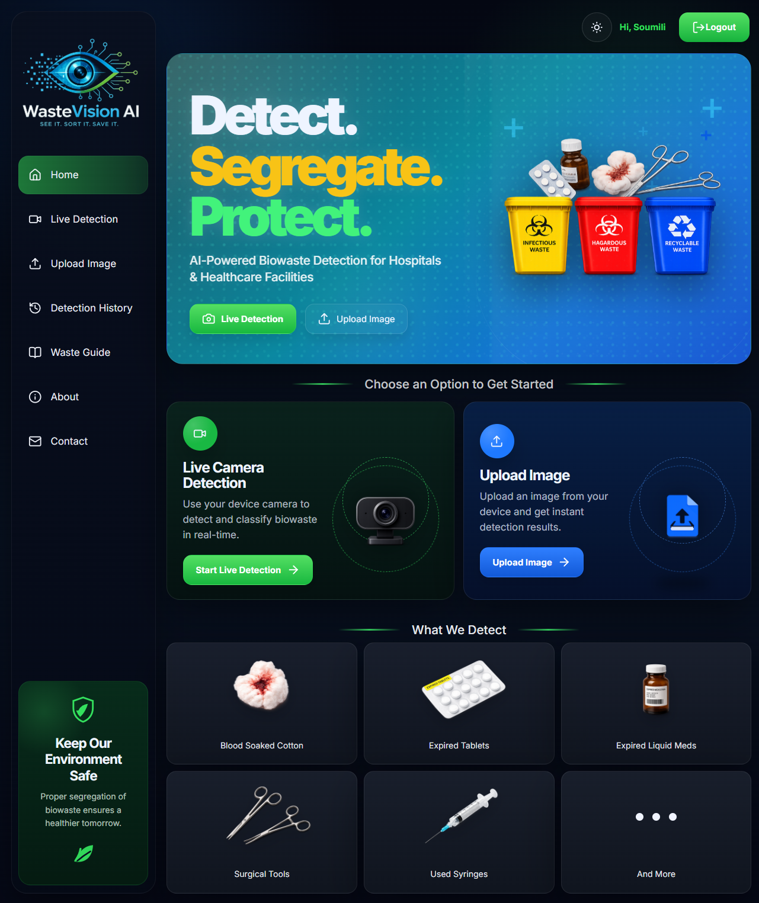
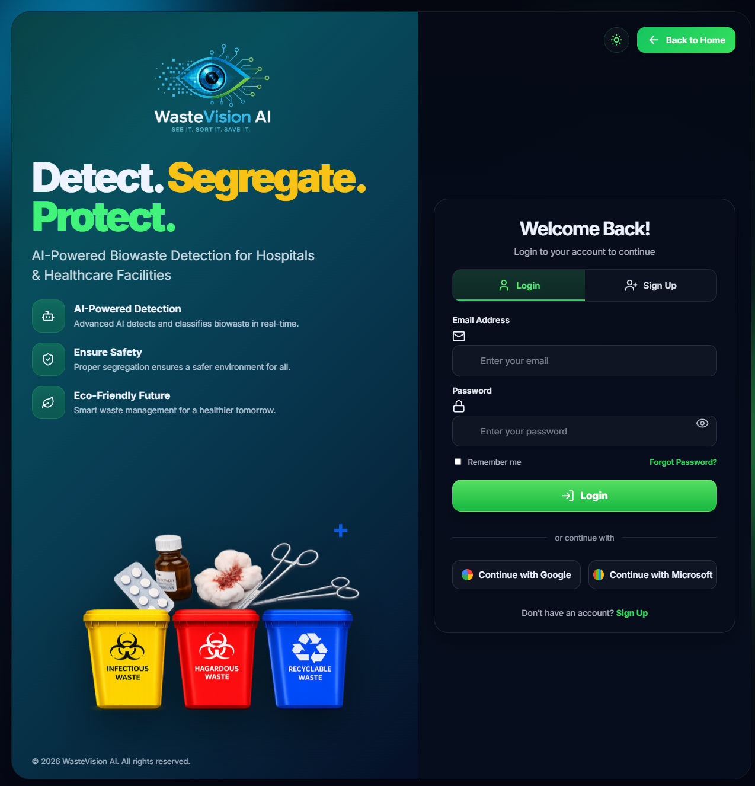
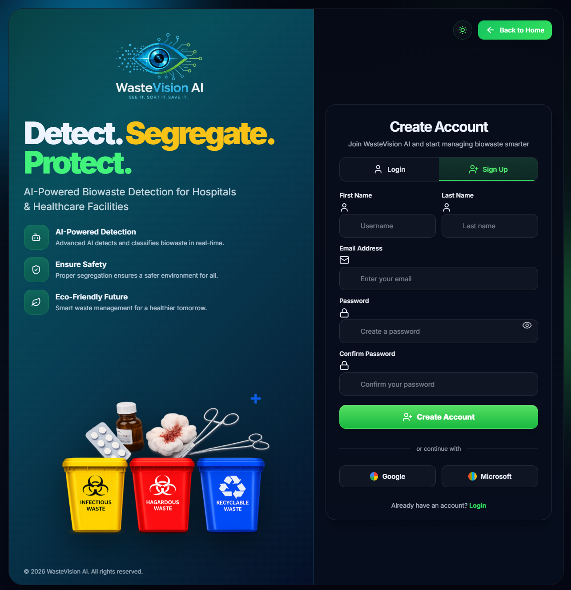
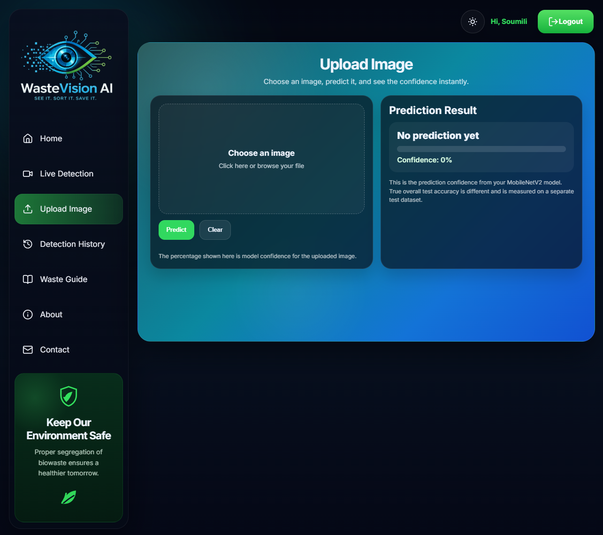
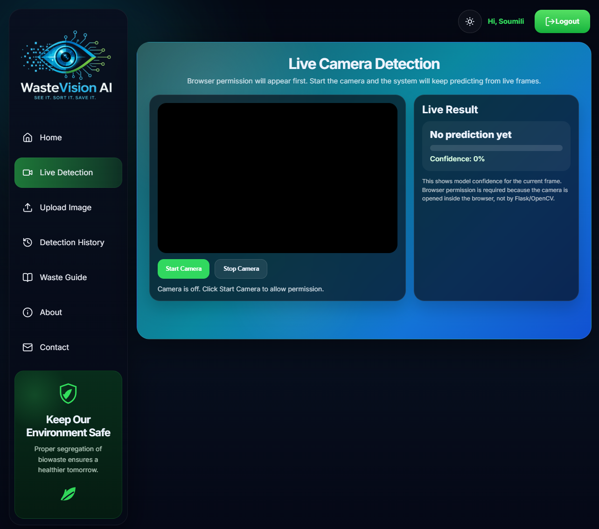
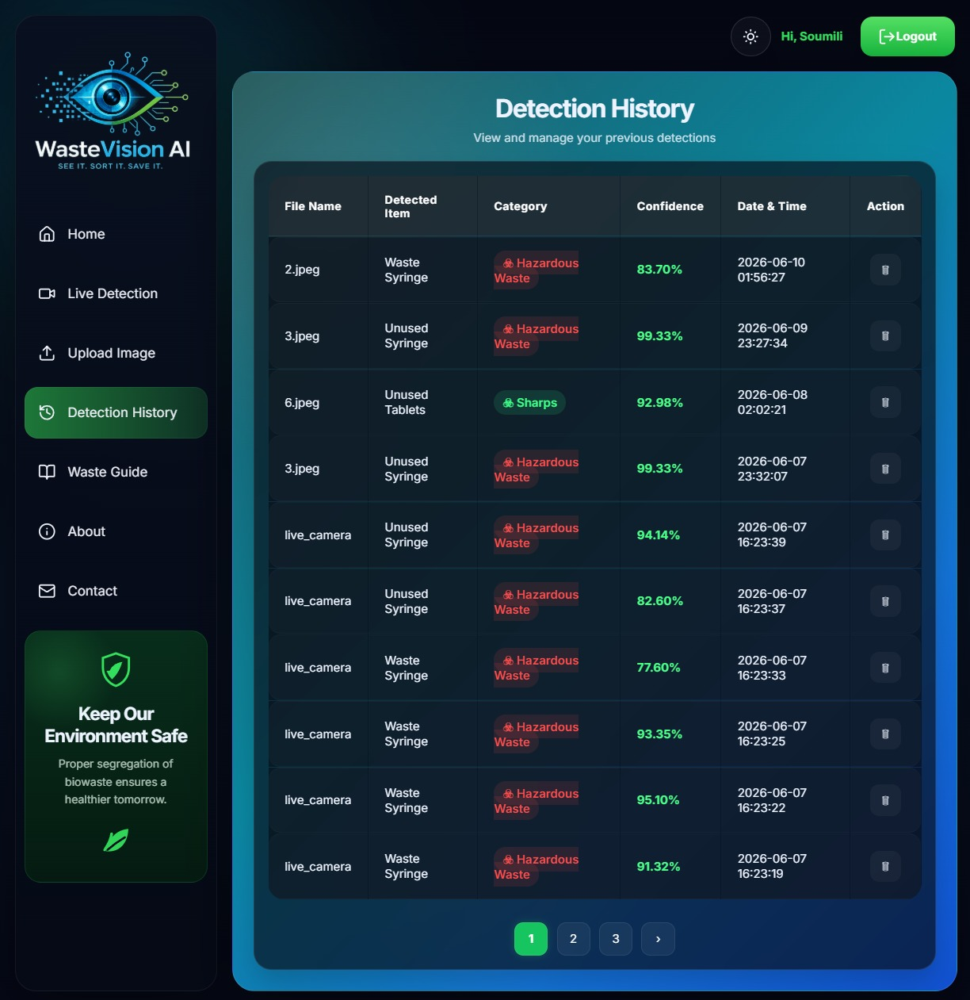
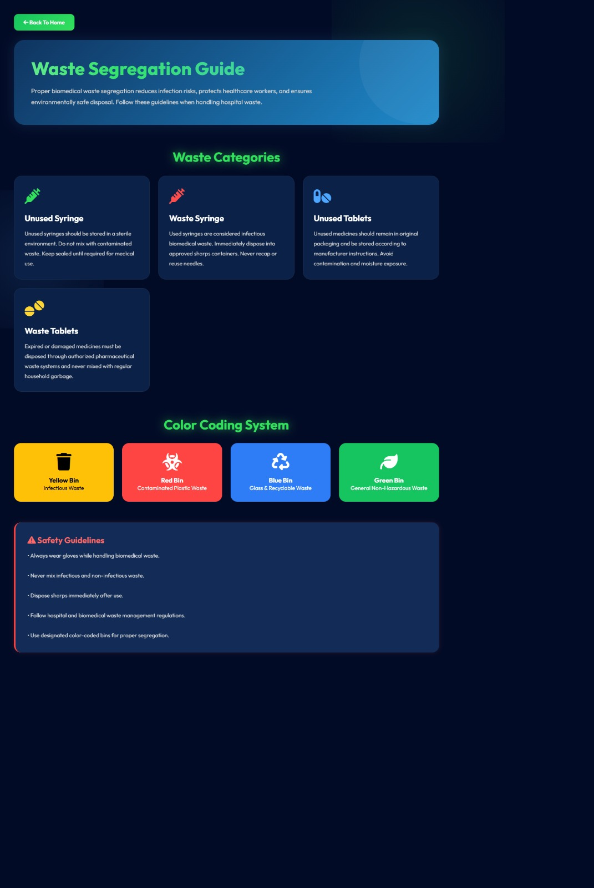
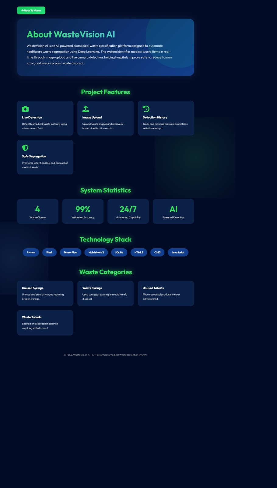
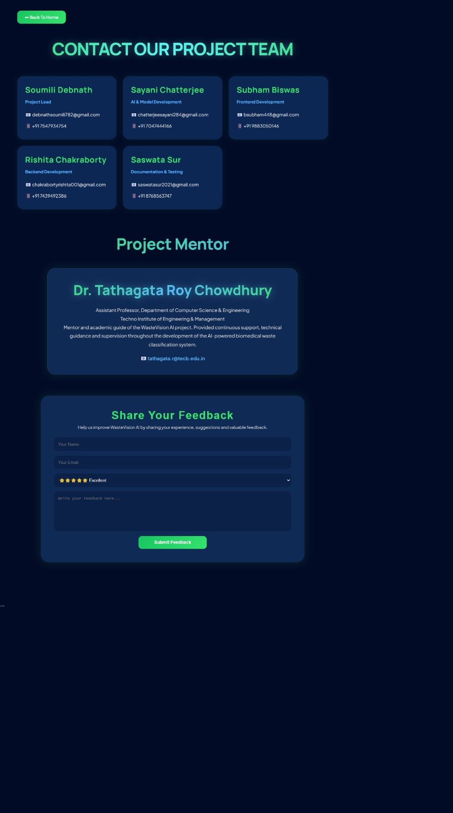

# ♻️ WasteVision AI

An AI-powered biomedical waste classification system built using **MobileNetV2**, **TensorFlow**, and **Flask**. The application classifies biomedical waste from uploaded images or live camera input, helping improve waste segregation and disposal.

---

## 🚀 Features

- 🔐 User Login & Signup
- 📷 Live Camera Detection
- 🖼️ Image Upload Detection
- 🧠 MobileNetV2-based Deep Learning Model
- 📊 Detection History
- 📖 Biomedical Waste Guide
- 📱 Responsive Web Interface
- ⚡ Fast Waste Classification

---

## 🛠️ Tech Stack

- Python
- Flask
- TensorFlow
- Keras
- MobileNetV2
- HTML5
- CSS3
- JavaScript
- SQLite

---

## 📂 Project Structure

```text
WasteVision_AI/
├── dataset/
├── model/
├── screenshots/
├── static/
├── templates/
├── uploads/
├── app.py
├── augment_dataset.py
├── train_model.py
├── main.py
├── history.db
└── README.md
```

---

## 📸 Project Screenshots

### Home Page (Before Login)


---

### Home Page (After Login)



---

### Login



---

### Signup



---

### Upload Detection



---

### Live Detection



---

### Detection History



---

### Waste Guide



---

### About



---

### Contact



---

## ⚙️ Installation

```bash
git clone https://github.com/debnathsoumili782-ui/WasteVision_AI.git

cd WasteVision_AI

pip install -r requirements.txt

python app.py
```

---

## 📊 AI Model

Model Used:

- MobileNetV2

Framework:

- TensorFlow
- Keras

Task:

Biomedical Waste Image Classification

---

## 👨‍💻 Authors

- Soumili Debnath
- Sayani Chatterjee
- Rishita Chakraborty
- Saswata Sur
- Subham Biswas

---

## 📄 License

This project is developed for academic and educational purposes.
